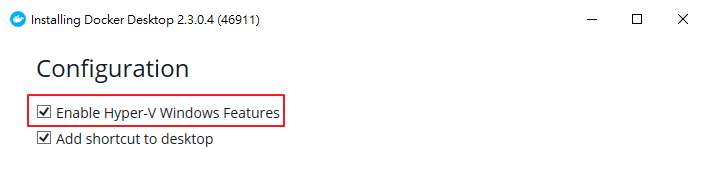
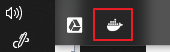
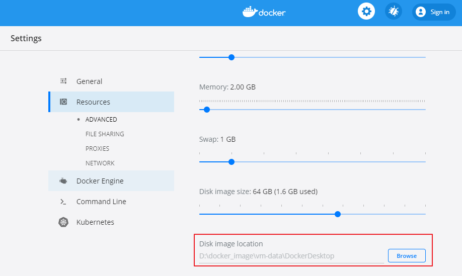
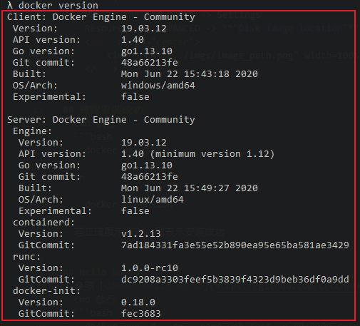

# 安裝 Docker in Windows 10

## 安裝步驟
- 至官網 [Docker](https://www.docker.com/) 下載最新安裝檔
  - 勾選 **"Enable Hyper-V Windows Features"**
    <div  align="center">    
        
    </div>
  - 視情況重新開機
- 目前預設安裝的 container 類型為 Linux container, 所以 image 的儲存位置無法通過修改 daemon.json 的 graph 屬性。此類型必須透過 Docker Desktop 的 Settings 進行設置: 
  - 啟動 Docker Desktop
  - 右下角會出現鯨魚小圖示, 等待小鯨魚動畫結束, 表示完成啟動
    <div  align="center">    
        
    </div>
  - MB3 on the 鯨魚小圖示 -> Settings
  - Resources -> ADVANCED -> **"Disk image location"**, 更改 image 的儲存位置
    <div  align="center">    
        
    </div>


## 確認安裝成功
- cmd 執行
  ```bash
  > docker version
  
  or  

  > docker --version
  ```
- 若正確顯示資料, 則表示安裝成功
    <div  align="center">    
        
    </div>

## Hello World
- 參照 [docker-hello-world](https://github.com/crccheck/docker-hello-world)
- cmd 執行
  ```bash
  > docker run -d --rm --name web-test -p 80:8000 crccheck/hello-world
  ```
- 打開瀏覽器, 查看 <http://localhost:80/>
- 若可以正常顯示頁面, 表示執行成功
    <div  align="center">    
        
    </div>

