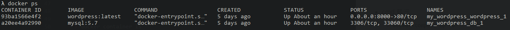

# 快速部屬 WordPress

## 什麼是 WordPress
- According to [Wiki-WordPress](https://zh.wikipedia.org/wiki/WordPress):
    > WordPress是一个以PHP和MySQL为平台的自由开源的博客软件和内容管理系统。
    > 截至2018年4月，排名前1000万的网站中超过30.6%使用WordPress。WordPress是最受欢迎的网站内容管理系统。
<!--
- 本網站就是用 WordPress 進行建立。
-->

## 準備專案檔
- 準備一個 `docker-compose.yml` 檔案, 其內容為
    ```bash
    version: '3.3'

    services:
    db:
        image: mysql:5.7
        volumes:
        - db_data:/var/lib/mysql
        restart: always
        environment:
        MYSQL_ROOT_PASSWORD: somewordpress
        MYSQL_DATABASE: wordpress
        MYSQL_USER: wordpress
        MYSQL_PASSWORD: wordpress

    wordpress:
        depends_on:
        - db
        image: wordpress:latest
        ports:
        - "8000:80"
        restart: always
        environment:
        WORDPRESS_DB_HOST: db:3306
        WORDPRESS_DB_USER: wordpress
        WORDPRESS_DB_PASSWORD: wordpress
        WORDPRESS_DB_NAME: wordpress
    volumes:
        db_data: {}
    ```


## 建立專案
- cmd 移動至 `docker-compose.yml` 所在的 directory 並執行
    ```bash
    > docker-compose up -d
    ```
- 執行結束後, cmd 執行
    ```bash
    > docker image ls
    ```
    應顯示 `wordpress` 和 `mysql` 兩個 image files。
    <div  align="center">    
        
    </div>
- cmd 執行
    ```bash
    > docker ps

    or

    > docker container ls
    ```
    應顯示兩個 docker containers 正在執行。
    <div  align="center">    
        
    </div>
    <div  align="center">    
        
    </div>


## Hello World
- 打開瀏覽器, 訪問 <http://localhost:8000/>
- 第一次訪問 <http://localhost:8000/> 需要設定後台管理者帳號。
    <div  align="center">    
        
    </div>
- 完成帳號設定後, 可進一步設定主題及插件。
- 若要用 markdown 編寫文章, 需要安裝 `WP Githuber MD` 插件。


## 啟動/關閉服務
- cmd 執行
    ```bash
    > docker container ls -a
    ```
    可以查看當前本地所有的 containers (無論有無運行)。
    <div  align="center">    
        
    </div>
- cmd 執行
    ```bash
    # my_wordpress_wordpress_1 and my_wordpress_db_1 are container names

    > docker start my_wordpress_wordpress_1 my_wordpress_db_1
    ```
    即可啟動服務。
- 啟動服務後, 訪問 <http://localhost:8000/wp-admin> 登入後台管理。
- 訪問 <http://localhost:8000/> 預覽上線效果。
- cmd 執行
    ```bash
    # my_wordpress_wordpress_1 and my_wordpress_db_1 are container names

    > docker stop my_wordpress_wordpress_1 my_wordpress_db_1
    ```
    即可關閉服務。


## Reference
- 參照 [Docker docs](https://docs.docker.com/compose/wordpress/#shutdown-and-cleanup) 的技術文檔。